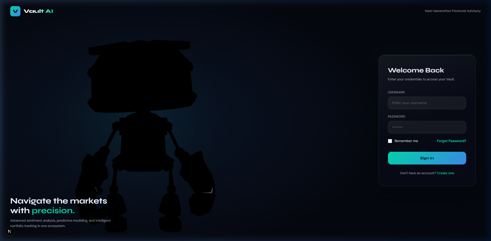
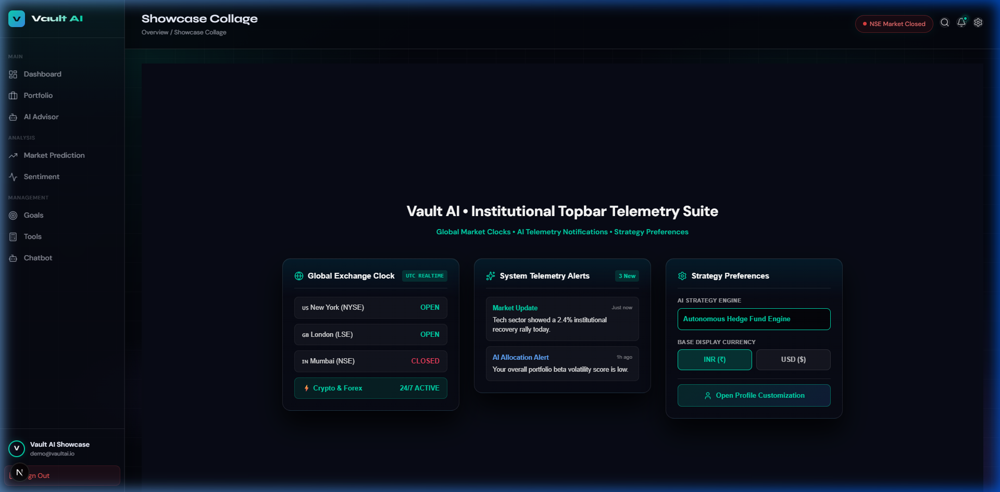
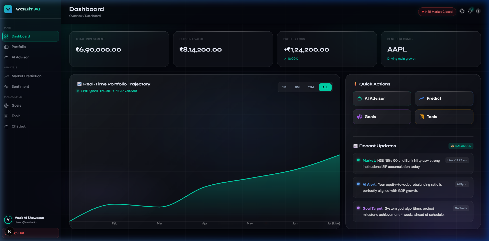
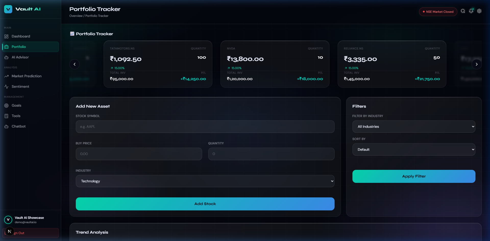
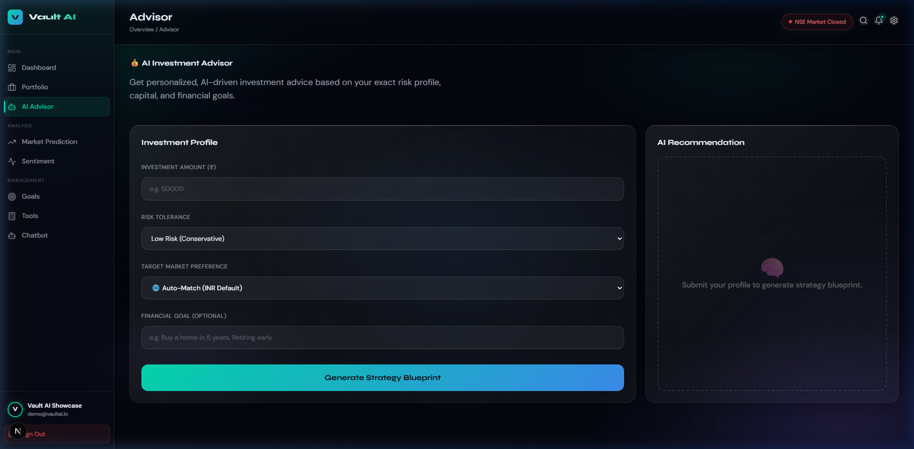
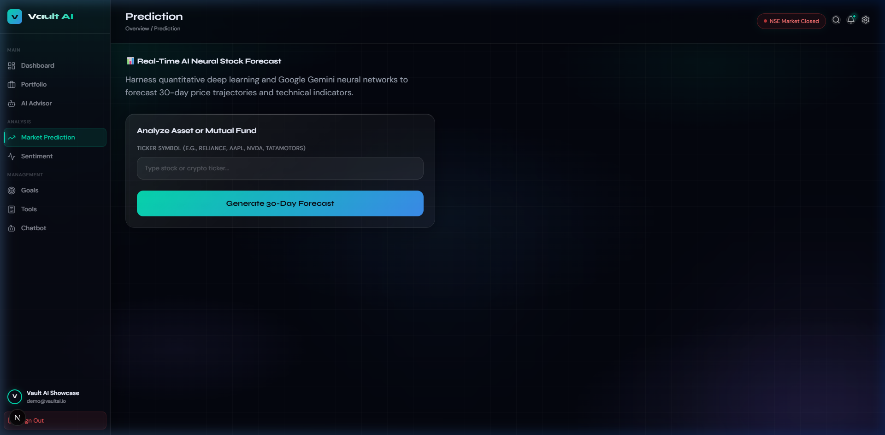
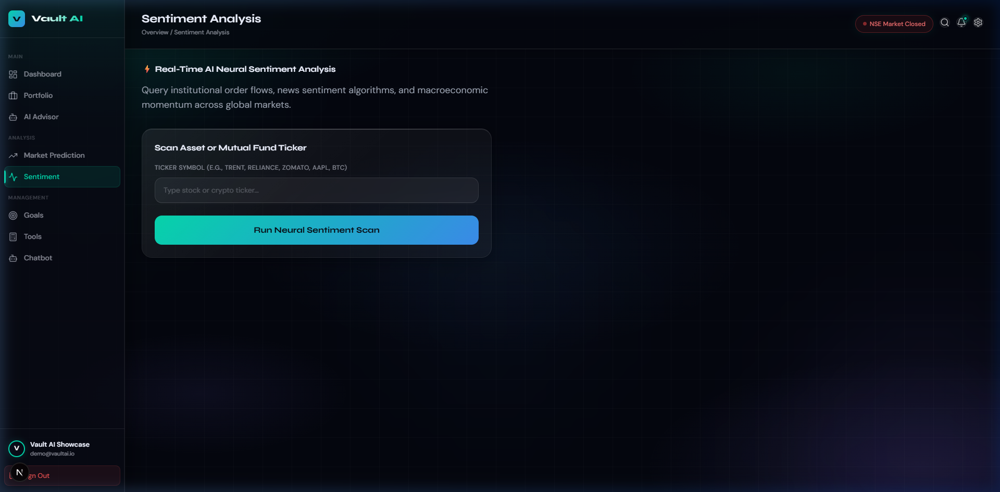
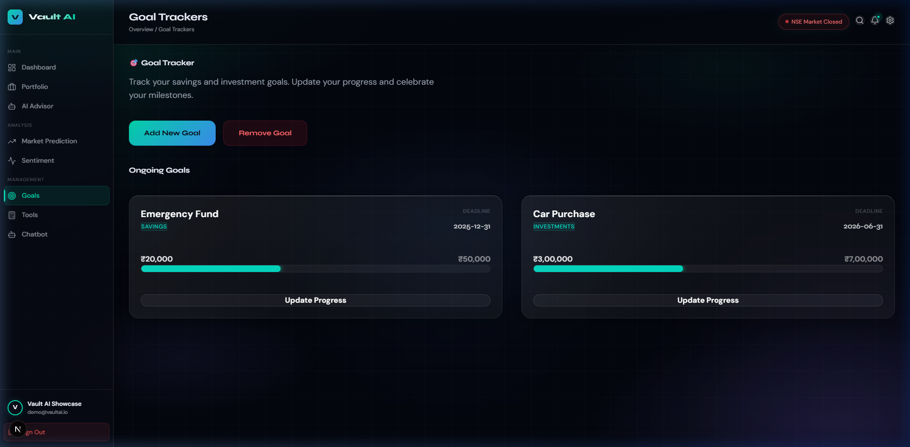
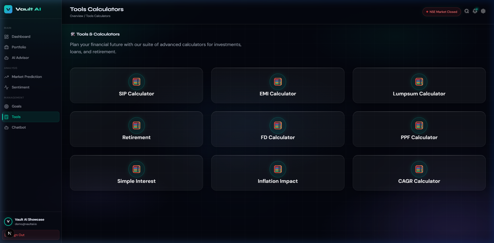
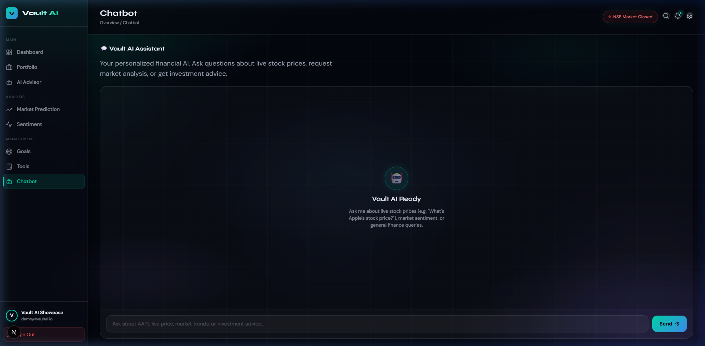

# **Vault AI — Personal Finance & Portfolio Management Web App**

[](https://vault-ai-vert-eight.vercel.app)

## **About**

The **Vault AI** project is a personal wealth management and stock tracking web application. This system simplifies the process of tracking live investment portfolios, analyzing market trends, and getting tailored AI financial advice. Designed with a clean dark-mode interface and smooth animations, it offers an easy-to-use experience for investors to manage their money and plan long-term financial goals.


## **Overview**

This application is built using **Next.js 16** and **React 19** for the full-stack architecture, with **MongoDB** used to store user accounts and investment portfolios. The AI advisory features use the **Google Gemini AI SDK**, while live stock market data is fetched from **AlphaVantage** and **Yahoo Finance**. User authentication is handled via NextAuth, and the app includes a dedicated demo account so visitors can explore the platform immediately without needing API keys or a live database. The frontend is styled using vanilla CSS to keep the design lightweight, fast, and responsive across all devices.


## **Platform Used**

- **Frontend & Backend Framework:** Next.js 16, React 19, TypeScript  
- **Database Management:** MongoDB  
- **AI & Machine Learning:** Google Gemini AI SDK  
- **Market Data APIs:** AlphaVantage, Yahoo Finance  
- **Charting & Graphics:** Chart.js, Recharts, HTML5 Canvas  


## **Features**

- **User Authentication:**
  - Secure login, registration, and session management using NextAuth.
  - **Demo Account:** Built-in preview account loaded with sample stocks (`Username: demo` | `Password: demo`).
- **Portfolio Tracker:**
  - Add and manage stocks, track purchase prices, and monitor real-time profit and loss.
  - Smooth local caching so stock data updates instantly without page refresh flickering.
- **AI Financial Advisor:**
  - Get personalized investment suggestions that automatically match your selected currency (**INR** or **USD**).
  - Filter market analysis by region (**Indian Markets**, **US Markets**, **Crypto**, or **Global**).
- **Market Predictions:**
  - Visual charts analyzing price trends, stock momentum, and market volatility.
- **Sentiment Analysis:**
  - Real-time gauges tracking market mood, news sentiment, and fear/greed indicators.
- **Goal Trackers:**
  - Create and track progress toward personal financial milestones like emergency funds or retirement targets.
- **Financial Tools & Calculators:**
  - Easy-to-use SIP compounding calculators and investment planning utilities.
- **AI Chatbot Assistant:**
  - Interactive chatbot available anytime to answer stock questions and explain financial concepts.
- **Modern UI & Customization:**
  - Responsive dark aesthetic, custom ring colors, and interactive avatar cropping.
  - First-time login disclaimer popup reminding users that AI suggestions are for informational purposes only.


## **Usage**

- **Live Cloud Demo:** Visit **[vault-ai-vert-eight.vercel.app](https://vault-ai-vert-eight.vercel.app)** and explore instantly using built-in demo credentials (`Username: demo` | `Password: demo`).
- **Registered Users:** Create a personal account to track real stock holdings, set currency preferences, and customize profile details.
- **Local Setup Instructions:**
  1. Clone the repository and install dependencies:
     ```bash
     npm install
     ```
  2. Copy `.env.example` to `.env` and configure your environment variables:
     - `GOOGLE_GENERATIVE_AI_API_KEY`: Get a free key from [Google AI Studio](https://aistudio.google.com).
     - `NEXT_PUBLIC_ALPHA_VANTAGE_API_KEY`: Get a free key from [AlphaVantage](https://www.alphavantage.co/support/#api-key).
     - `NEXTAUTH_SECRET`: Generate a random secret string (or run `npx auth secret` in your terminal).
     - `MONGODB_URI`: Connection string for your local MongoDB or Atlas database.
  3. Start the local development server:
     ```bash
     npm run dev
     ```
  4. Open `http://localhost:3000` in your web browser.


## **📸 Platform Gallery**

| **Authentication Portal** | **Topbar Overview** |
|:---:|:---:|
|  |  |

| **Dashboard Overview** | **Portfolio Tracker** |
|:---:|:---:|
|  |  |

| **AI Financial Advisor** | **Market Prediction** |
|:---:|:---:|
|  |  |

| **Sentiment Analysis** | **Goal Trackers** |
|:---:|:---:|
|  |  |

| **Tools & Calculators** | **AI Chatbot Assistant** |
|:---:|:---:|
|  |  |
